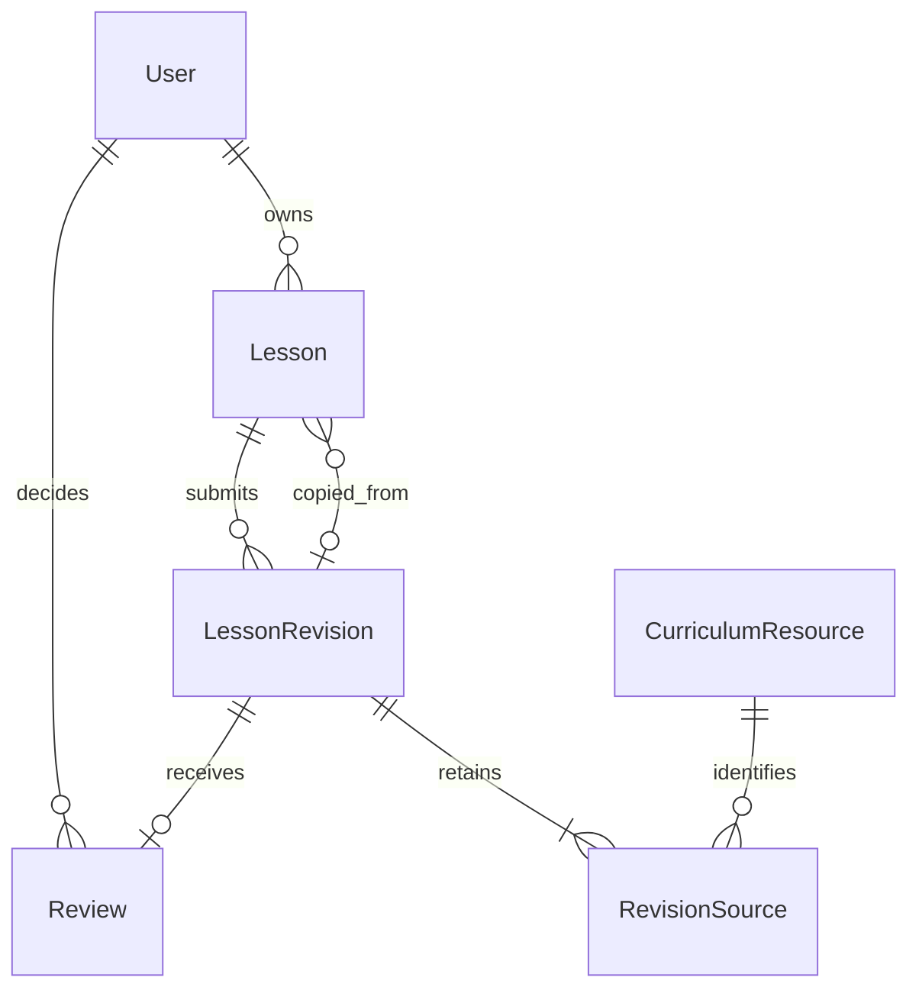

# LessonForge initial domain schema

## Scope and authority

The six Prisma models and initial migration SQL now implement this storage design.
The implementation agent generated the migration offline and tested it only in
a disposable database. On 2026-10-09, the developer confirmed successful application
to `lessonforge_dev` and up-to-date migration status. Authentication, seeding, and
workflow services remain pending. The
[project specification](project-specification.md) is authoritative, particularly
sections 2–8. The [architecture](architecture.md) assigns authorization,
validation, and transactions to NestJS. The [roadmap](roadmap.md) places the manual
workflow before AI integration. The existing `backend/prisma/schema.prisma`
contains the entities below with its existing generator/runtime configuration.
See [verification evidence](domain-schema-verification.md) and the
[migration procedure](development-setup.md#initial-migration-and-isolated-constraint-verification).

Use five domain entities from the specification plus one supporting source-reference
table: `User`, `CurriculumResource`, `Lesson`, `LessonRevision`, `Review`, and
`RevisionSource`. Store a lesson's one editable draft on `Lesson`; do not create a
revision for every save. Submission creates immutable history. Approval of that
exact revision makes it available in the library; there is no separate publishing
step or publication status.

The confirmed MVP context is Grade 4 Mathematics in one fictional school, using
a small set of original sample resources about fractions. Clearly label these as
demonstration material without claiming official curriculum alignment; exact
resource text can be prepared during seeding. Accounts are setup-created teachers
and administrators. Do not add school tenancy, registration, uploads, student
accounts, search infrastructure, PDF export, or AI-provider tables. Session storage
belongs to the later authentication implementation, as already noted in the
architecture. Product decisions recorded below are confirmed; the storage and
transaction design describes future NestJS services; models and migration SQL
are implemented and the developer has verified development-database application.

## Entities and relationships

Each lesson has exactly one owner, who must be a teacher. A teacher can own many
lessons, including none. Each submitted revision belongs to exactly one lesson;
an unsubmitted lesson has no revisions. A revision has zero reviews while pending
and one final review once decided. An administrator can review many revisions.
Each revision retains at least one source reference; a resource can appear in
many revisions. Each copied lesson identifies one source approved revision;
an original lesson has no copy source, and one approved revision can be copied
many times. All these role and minimum-count conditions need backend validation.

### Field conventions

Use application-generated UUID primary keys, PostgreSQL `timestamptz` timestamps,
and integer counters. UUIDs allow new identifiers to be allocated inside a
transaction; they do not replace authorization. Unless marked nullable, fields
are required. Keep enum values narrow: `TEACHER`/`ADMIN`,
`APPROVE`/`REQUEST_CHANGES`, and `MANUAL`/`AI_ASSISTED`.

### User

Purpose: stable authentication identity, lesson owner, and accountable reviewer.

| Field | Proposed storage and meaning |
|---|---|
| `id` | UUID primary key. |
| `email` | Unique canonical lowercase, trimmed login identifier. Recommended identity choice; the specification does not select email versus username. |
| `displayName` | Nonempty text for ownership and reviewer display. |
| `passwordHash` | Text containing a password hash, never a plaintext password. Hashing algorithm and session implementation belong to authentication work. |
| `role` | `TEACHER` or `ADMIN`; one role per setup-created account. |
| `createdAt`, `updatedAt` | Creation and last update timestamps. |

The authenticated user supplies owner/reviewer identity through NestJS, never a
trusted client-provided identity. Role checks apply on every operation. This MVP
does not need multi-role memberships or an account-management interface. Keep
user IDs stable and prohibit account deletion through the application so earlier
reviewer identity and ownership remain resolvable. Display names are not immutable
audit snapshots; changing a name does not change which user made a decision.

### CurriculumResource

Purpose: administrator-managed sample material that teachers select as a source.

| Field | Proposed storage and meaning |
|---|---|
| `id` | UUID primary key. |
| `title` | Nonempty text. |
| `subject`, `grade` | Text matching Mathematics and Grade 4. No subject/grade catalog tables yet. |
| `sourceReference` | Nonempty human-readable provenance/citation text. Include a URL or attribution when available; do not require an external URL or invent curriculum alignment. |
| `contentText` | Nonempty sample resource text, not an uploaded document. |
| `retiredAt` | Nullable timestamp; null means available for selection. |
| `version` | Integer starting at 1, increased on updates and retirement for conflict detection and snapshot provenance. |
| `createdAt`, `updatedAt` | Creation and last update timestamps. |

Only administrators create, update, or retire resources. Use retirement rather
than application hard deletion. No resource-version table is needed initially:
draft source selections and submitted source rows capture the selected resource
version and its relevant text. Retired resources cannot be newly selected.
Existing draft selections and copies of approved lessons retain their trusted
selection-time snapshots and remain submittable. Ordinary saves never refresh
snapshots. An owning teacher may explicitly refresh a selected resource to its
latest active version; NestJS captures the replacement snapshot. Refreshing a
retired resource is rejected without replacing the existing snapshot. Submitted
snapshots remain immutable.

### Lesson

Purpose: stable lesson identity and teacher ownership, with one current editable
draft and a pointer to the latest submitted revision.

| Field | Proposed storage and meaning |
|---|---|
| `id` | UUID primary key. |
| `ownerId` | Required FK to `User.id`; must identify a teacher. Ownership is fixed after creation. |
| `draftContent` | Nullable JSONB. An object containing incomplete or complete lesson fields and server-captured source selections while editing; null while submitted or approved. |
| `draftGenerationOrigin` | Nullable `MANUAL`/`AI_ASSISTED`; present exactly when `draftContent` is present. Starts as `MANUAL` for manual work. |
| `currentRevisionId` | Nullable pointer to the latest submitted `LessonRevision` belonging to this lesson. Null before the first submission. |
| `copiedFromRevisionId` | Nullable FK to the exact approved source revision, preserving both the original lesson reference and the copied version. Set once when creating a copy. |
| `version` | Positive integer, incremented on every draft save and lifecycle change. Required in mutation preconditions. |
| `createdAt`, `updatedAt` | Creation and last mutation timestamps. |

Do not store `Lesson.status`, `isPublished`, or `isApproved`. Expose the logical
workflow status described in the specification by deriving it from the draft,
current submitted revision, and that revision's review. `currentRevisionId` refers
to the latest submitted revision, including while a new draft is being prepared
after requested changes. It is not a pointer to the mutable JSON draft.

### LessonRevision

Purpose: immutable submitted content, revision numbering, and generation origin.

| Field | Proposed storage and meaning |
|---|---|
| `id` | UUID primary key. |
| `lessonId` | Required FK to `Lesson.id`. |
| `number` | Positive integer starting at 1; unique within the lesson. |
| `content` | Required JSONB containing validated lesson fields, excluding source snapshots stored in `RevisionSource`. |
| `generationOrigin` | Required `MANUAL`/`AI_ASSISTED`, frozen from the draft at submission. |
| `submittedAt` | Required timestamp, set by the backend. |

Every row is a submitted revision; there is no draft/submitted flag on this table.
Never update its content, number, origin, or parent lesson. Submission inserts it
and all source rows in one transaction. Owner identity comes from the immutable
lesson ownership; a separate submitter field is unnecessary while only the owner
may submit.

### RevisionSource

Purpose: relational resource reference plus immutable source information used by
the submitted revision, even after the original resource changes or is retired.

| Field | Proposed storage and meaning |
|---|---|
| `revisionId`, `resourceId` | Composite primary key; required FKs to `LessonRevision.id` and `CurriculumResource.id`. One resource appears once per revision. |
| `resourceVersion` | Positive version integer captured at selection. It is provenance, not an FK to a resource-version table. |
| `snapshot` | Required JSONB with resource title, subject, grade, source reference, and resource text as selected. |

The draft keeps an array of `{ resourceId, resourceVersion, snapshot }` selections
inside its JSON. NestJS captures them from the resource when selected, or from the
approved source revision when copied. Clients can select/remove resource IDs but
cannot supply or rewrite trusted snapshot fields. Draft saves update lesson fields
without rebuilding source snapshots from arbitrary client JSON or refreshing
them from current resource data. Explicit refresh is a separate authorized,
version-checked action that captures the latest active resource in NestJS and
replaces only that editable selection's snapshot.

On submission, convert those selections into `RevisionSource` rows. This design
supports a nonempty collection of source references as required by section 6;
using just one resource remains sufficient. It does not require a multi-resource
AI interface. Draft JSON resource IDs have no database FK: NestJS validates them;
submitted source rows have actual FKs. Snapshotting the resource text costs some
storage but preserves the material the author used without building a resource
versioning subsystem. Resource updates and retirement do not invalidate retained
draft or copied selections. Submission uses their trusted stored snapshots,
including retired or older resource versions, unless the teacher explicitly
refreshed the selection while editing. Neither submission nor refresh changes
any previously submitted snapshot.

### Review

Purpose: one final decision on one exact submitted revision, preserving reviewer
identity and feedback.

| Field | Proposed storage and meaning |
|---|---|
| `id` | UUID primary key. |
| `revisionId` | Required unique FK to `LessonRevision.id`. |
| `reviewerId` | Required FK to `User.id`; must identify an administrator. |
| `decision` | `APPROVE` or `REQUEST_CHANGES`. |
| `feedback` | Nullable text on approval; required nonblank text when requesting changes. |
| `decidedAt` | Required backend timestamp. |

Use one final review per submitted revision. The specification needs a decision
and resubmission history, not multiple advisory reviews or a discussion thread.
If another administrator races to decide the same revision, uniqueness and the
lesson mutation precondition reject the second decision. There is no decision
editing, revocation, or extra rejection state in the specified MVP.

## Lesson-content storage shape

Use one fixed, validated JSON object for lesson content, with ordered arrays where
order matters. Draft fields may be absent or incomplete. Submitted fields must
satisfy section 6 of the specification. Do not turn every objective, material, or
activity into a database table: they are edited, submitted, and copied together.

| Field in the content object | Proposed submitted shape and validation |
|---|---|
| `title` | Nonblank string. |
| `subject`, `grade` | Nonblank strings matching Mathematics and Grade 4. |
| `durationMinutes` | Positive whole number. |
| `learningObjectives` | Nonempty array of nonblank strings. |
| `materials` | Required array; each supplied entry must be a nonblank string. An empty array is valid and means “No additional materials required.” |
| `introduction` | Object with nonblank `text` and positive whole-number `durationMinutes` of at least one minute. |
| `activities` | Nonempty ordered array of objects, each with nonblank `teacherTasks`, nonblank `learnerTasks`, and positive whole-number `durationMinutes` of at least one minute. |
| `assessment` | Object with nonblank `text` and positive whole-number `durationMinutes` of at least one minute. |
| `differentiation` | Object with nonblank `learnerSupport` and nonblank `extensionActivities`. |
| Source references | Nonempty draft selection array; submitted references are the revision's `RevisionSource` rows, not a second duplicate JSON source list. |

Submission requires
`introduction.durationMinutes + sum(activities.durationMinutes) + assessment.durationMinutes == durationMinutes`.
Reject zero, negative, or fractional durations for the introduction, each activity,
and assessment. The total must also be a positive whole number. Do not assign
extra timings to objectives, materials, or differentiation: the specification
totals introduction, activities, and assessment only. Store no-materials lessons
as `materials: []`, not a sentinel string; the field must still be present on
submission. Missing/null materials or any blank supplied entry fails validation.

There is no required persisted topic separate from the title: section 7 supplies
a topic to AI generation, which is deferred. Plain text is sufficient; rich-text
formatting and attachments are not specified. Reject unknown content fields and
apply practical payload bounds in NestJS, documenting their limits during
implementation. JSONB keeps aggregate writes and snapshots simple, at the cost
of fewer SQL-level checks and less convenient field-level reporting. Those
tradeoffs suit the current MVP; validate the same shape at every submission and
when accepting future AI output.

## Lifecycle and authorized actions

The following labels are derived API states, not independently stored enums:

| State | Stored facts |
|---|---|
| `DRAFT` | Draft present; no submitted revision yet. |
| `SUBMITTED` | Draft absent; current submitted revision exists and has no review. |
| `CHANGES_REQUESTED` | Current revision has a `REQUEST_CHANGES` review; draft present, initially copied from that revision. |
| `APPROVED` | Current revision has an `APPROVE` review; draft absent. |

Any other combination is an invariant failure, not another product state. Fetch
the lesson and current review in one query or transaction so the derived state
does not mix records from different moments. Do not store a review status on a
revision, a separate approval flag, or a publication row.

| Action | Actor | Allowed starting state | Transactional result |
|---|---|---|---|
| Create a manual lesson | Teacher | No lesson | New owned `DRAFT`, incomplete content allowed, origin `MANUAL`. |
| Save content | Owning teacher | `DRAFT` or `CHANGES_REQUESTED` | Save editable content using the expected lesson version; preserve selected snapshots and submitted history without refreshing resources. |
| Select/remove a resource | Owning teacher | `DRAFT` or `CHANGES_REQUESTED` | Version-check the lesson; new selections require an active resource and a NestJS-captured snapshot. Retain unchanged selections as stored, even if retired. |
| Explicitly refresh a selected resource | Owning teacher | `DRAFT` or `CHANGES_REQUESTED` | Version-check the lesson and confirm the resource is active; NestJS replaces the selected snapshot with its latest active version and increments the lesson version. A retired resource cannot be refreshed. |
| Submit/resubmit | Owning teacher | `DRAFT` or `CHANGES_REQUESTED` | Validate content and retained trusted sources, including retired selections; insert next numbered immutable revision and source rows, move current pointer, clear draft and draft origin: `SUBMITTED`. |
| Request changes | Administrator | `SUBMITTED` | Insert immutable review with feedback; create editable draft from the reviewed snapshot and source rows: `CHANGES_REQUESTED`. |
| Approve | Administrator | `SUBMITTED` | Insert immutable approval review: `APPROVED`; that exact revision is in the approved library. |
| Copy approved content | Teacher | Source lesson `APPROVED` | Create a separate owned `DRAFT` with copied content, trusted source snapshots (including retired resources), origin, and `copiedFromRevisionId`; source lesson stays approved. |

Teachers can read their lessons and review feedback and browse approved content.
Administrators can read submitted revisions and approved content and manage
resources; the specification grants them no content-editing permission. No owner
transfer, withdrawal, approval reversal, or editing an approved lesson in place
is proposed. Reuse approved content through the specified copy action. Additional
actions would require an explicit specification decision.

On requested changes, creating the editable draft immediately avoids an extra
persisted workflow state. Saving it never modifies the older revision or feedback.
Resubmitting creates revision 2, 3, etc.; revision 1 and its review remain intact.
Copying follows `copiedFromRevisionId -> LessonRevision.lessonId` to recover the
original lesson reference, so there is no conflicting second copy-source field.
The new lesson's submissions start at number 1 and require their own review;
copying does not transfer approval.

## Keys, constraints, indexes, and deletion

| Area | Database enforcement in the initial migration |
|---|---|
| Identity | UUID primary keys on the five domain tables; composite PK `(revisionId, resourceId)` on `RevisionSource`. Unique normalized `User.email`, with a check that stored email is lowercase and trimmed. |
| Relationships | Required FKs for owner, revision parent, reviewer, review target, and submitted source resource. Optional FK for copy source. |
| Current pointer | Unique `(lessonId, id)` on `LessonRevision`, supporting composite FK `(Lesson.id, Lesson.currentRevisionId) -> (LessonRevision.lessonId, LessonRevision.id)`. Nullable pointer permits initial lesson creation; a nonnull pointer must belong to that lesson. |
| Numbering and decisions | Unique `(lessonId, number)`; unique `Review.revisionId`. Positive revision/resource/lesson counters. |
| Basic shape | JSON columns must contain objects. Draft content and draft origin are either both present or both null. Review decision and roles/origins use constrained enum values. |
| Feedback | A `REQUEST_CHANGES` review requires `feedback IS NOT NULL` and nonblank trimmed text. Null approval feedback is allowed; normalize empty optional approval feedback to null. |
| Immutable records | PostgreSQL triggers reject updates/deletes of `LessonRevision`, `RevisionSource`, and `Review` rows, including their identifiers, parents, and metadata. These protect existing rows; NestJS must also prohibit adding source rows to an already submitted revision. |
| Deletion | Use `ON DELETE RESTRICT` for all FKs; no history-erasing cascades or nulling ownership/provenance pointers. No application hard-delete endpoints for users, resources, lessons, revisions, or reviews. Retire resources. |

The composite current-pointer relation creates a circular relationship. Create a
lesson with a null pointer, then insert its revision and set the pointer within
one transaction; no deferred FK or temporarily invalid nonnull pointer is needed.
The composite FK proves membership, not that a revision is the latest; NestJS
enforces the latter under the lesson lock.

Draft JSON references are not covered by FKs, and the database cannot verify a
minimum of one `RevisionSource` through an ordinary row check. Backend transactions
must enforce both. FK restrictions protect referenced records, not every
unreferenced row from direct deletion; absence of application deletion paths and
controlled database access are still necessary. Protect ownership and copy-source
fields as write-once in future NestJS services; the initial migration includes a
narrow trigger preventing later changes to these fields as database defense.

Start with these indexes beyond PKs/unique constraints:

- `Lesson(ownerId, updatedAt)` for an owner's lesson list.
- `Lesson(currentRevisionId)` and `Lesson(copiedFromRevisionId)` for joins and
  reference checks.
- `Review(reviewerId)` and `RevisionSource(resourceId)` for FK/reference lookups.

The unique revision indexes already support lesson-history lookup; the unique
review target supports pending/approved joins. Derive review queues and the
approved library by joining current revisions to reviews, filtering absent reviews
or `APPROVE` respectively. With the agreed sample dataset, do not add search,
JSON-field, or speculative status indexes. Add resource/list sorting indexes only
if real queries justify them.

Checks and triggers are implemented as reviewed SQL in the initial migration,
in addition to Prisma's models. UUID defaults and `updatedAt` maintenance are
Prisma-client behavior, not database UUID defaults or timestamp-update triggers;
direct SQL must supply identifiers and required update timestamps. SQL checks
use PostgreSQL whitespace matching for email edges and change-request feedback;
full identity/content normalization remains a NestJS responsibility. Privileged
DDL, trigger disabling, or `TRUNCATE` can bypass row-level protections; application
services must not expose these operations, and deployment roles remain future work.

## NestJS transactions and concurrency

Database constraints do not prove that an owner is a teacher, a reviewer is an
administrator, content is complete, source metadata is authentic, a copied revision
is approved, or a lifecycle action is authorized. NestJS must enforce these using
the authenticated actor and current persisted facts.

Use the lesson row as the coordination point for every save, source selection or
refresh, submission, and review:

1. Require the caller's expected `Lesson.version`; review requests also identify
   the exact `revisionId` being reviewed.
2. In one transaction, lock the lesson row and authorize the requested action
   using the actor's role and persisted ownership. Authorization must succeed
   before a version-conflict response can return current lesson content. Then
   check version, current revision, and allowed derived state. Never accept a
   review just by lesson ID.
3. Validate the draft and trusted source selections, then perform all inserts and
   pointer/draft changes atomically. Allocate the next revision number under that
   same lock. Increment the lesson version before committing.
4. Return the committed content and new version. A stale precondition produces a
   conflict response; roll back and return only current state/content that the
   authorized caller may read. If authorization fails, return an access denial
   without current lesson content or version, even if the supplied version is
   stale. An administrator's conflict payload must not expose an editable draft
   they lack permission to read. Never silently retry a stale mutation against
   new content.

Use parameterized SQL if explicit row locking is needed alongside Prisma. Keep
transactions short; no network calls or AI generation inside them. Unique review
and revision-number constraints are additional race defenses. Roll back the whole
action on a constraint failure or validation failure; do not leave a review without
its draft transition or a current pointer without complete source rows.

Resource edits/retirement similarly require the expected resource version. Source
selection and explicit refresh lock/read the resource in their transactions to
confirm it is active and capture its latest version consistently with retirement
and updates. Refresh uses the lesson's expected version and replaces only the
selected draft snapshot; a failed or conflicting refresh preserves the saved
selection. Ordinary saves do not refresh snapshots, and submission accepts
retained trusted selections even if their resource is now retired or updated.
Copying locks/validates the approved source lesson and revision and creates the
new lesson atomically. A copied draft must retain the approved source snapshots,
not silently read newer resource text. Submitted content and source snapshots
become visible together only after commit. No later backend operation may insert
extra source rows into that submission.

Full JSON content validation, timing sums, minimum sources, role checks, state
combinations, latest-revision selection, approved-copy eligibility, and immutable
source-set membership remain NestJS responsibilities. The database's append-only
row protection does not on its own enforce all cross-table workflow invariants.
Test both layers rather than describing every rule as a database constraint.

## AI provenance, deferred implementation

Reserve the generation-origin enum now; manual creation uses `MANUAL`. When AI
work is implemented later, adopting AI-generated content into the editable draft
sets `AI_ASSISTED` and preserves the selected source snapshots. Keep this origin
after human edits and when copying AI-assisted approved content so provenance is
not silently lost. This describes origin, not whether AI approved the lesson.
Only backend-controlled operations can set it; ordinary client saves cannot erase
it. Freeze it on each submitted revision. No AI endpoint, provider configuration,
generation-job entity, automatic submission, approval, or publication is added by
this proposal. Future generation results must pass runtime validation and a draft
version check before adoption; failure leaves saved work intact.

## Decision status

### Confirmed product decisions

| Area | Confirmed decision |
|---|---|
| MVP context | Grade 4 Mathematics, with a small set of original fraction resources clearly labeled demonstration material without claiming official curriculum alignment. Exact text is prepared during seeding. |
| Resource retirement and snapshots | No new selection of retired resources. Existing selections and approved copies retain trusted selection-time snapshots and remain submittable. Ordinary saves never refresh them. Teachers may explicitly refresh a selected resource to its latest active version through NestJS; submitted snapshots remain immutable. |
| Timing | Introduction, each activity, and assessment require positive whole-number durations of at least one minute. Their sum equals the positive whole-number total lesson duration. |
| Materials | The materials array is required; an empty array is valid and means “No additional materials required.” Every supplied entry is nonblank. |
| Conflict-response authorization | Authorize the action before returning current lesson content in a version-conflict response, and include only content the caller is permitted to read. |

These decisions are developer-confirmed product policy, not open questions.
The four original product questions are resolved. No blocking product question
remains for this initial design. Exact resource text is seed preparation work;
session storage, password hashing, and payload bounds remain implementation
choices for their respective tasks. Prisma models and the reviewed initial
migration SQL are implemented; the developer confirmed application to the
development database on 2026-10-09. Future schema changes require new migrations.

### Implementation choices recommended without a new product feature

- One role per seeded account; canonical email login and password hashes. This
  stays small while the session-storage mechanism remains an authentication task.
- JSONB for whole lesson content, integer minutes, plain text, and arrays for
  ordered activities/objectives/materials. Normalize identity, history, decisions,
  and submitted resource references where relationships need FKs.
- One mutable draft on the lesson, immutable revisions only on submission, and
  one terminal review per revision. This avoids a generic workflow engine and
  captures the specified resubmission history.
- Derive status and library membership rather than duplicating decision flags.
  The extra join is preferable to contradictory approval/publication fields.
- Create the revision draft when requesting changes; keep approved lessons closed
  to editing and use copies for reuse. These implement the specified paths without
  inventing withdrawal or reopening actions.
- UUIDs, expected-version checks, lesson row locking, restricted deletion, and
  immutable-row triggers. These are data-integrity mechanisms, not product scope.

If multiple reviewer rounds on one revision, editing approved lessons in place,
or correction/revocation of decisions is wanted later, update the specification
and design first. None is assumed here or needed for the documented MVP.

## Proposed implementation order

1. Review the proposed implementation choices against the confirmed Grade 4
   Mathematics context and prepare the original fraction demonstration resources
   during seeding. Keep the AI milestone deferred.
2. Completed: translate entities, enums, relations, indexes, and SQL protections
   into models and a reviewed initial migration, with real disposable-database
   constraint tests. The developer also verified development-database application
   on 2026-10-09; ordinary CI tests remain database-free.
3. Implement setup-created users, password authentication/session handling, and
   backend role/ownership checks. Seed sample resources without production secrets.
4. Implement administrator resource management and teacher draft creation, save,
   source selection, explicit refresh, retirement rules, and conflict handling.
   Test incomplete drafts and unauthorized access before adding submission.
5. Implement validated submission, immutable revisions/sources, history retrieval,
   and pending-review queries in transactions.
6. Implement request changes, resubmission, approval, approved-library browsing,
   and copying; test decision races, stale versions, and preserved history.
7. Add AI drafting only at its roadmap milestone, reusing draft validation,
   provenance, and version guards; never grant it approval/publication authority.

Storage implementation and disposable migration verification are recorded in
the [verification guide](domain-schema-verification.md). These results do not
establish implementation of authentication, lesson APIs, or lifecycle transactions.

## Acceptance examples for implementation

| Scenario | Expected result |
|---|---|
| Teacher saves only a title | Draft saved; no revision inserted. Submission fails until required fields, sources, and timings are valid. |
| Teacher B edits or submits Teacher A's lesson with a stale version | Backend denies access, including when B knows the UUID; no mutation and no current lesson content or version in the response. |
| Teacher attempts approval, or administrator edits submitted content | Backend denies the action; no history change. |
| Introduction 5 + two activities 10 and 15 + assessment 5, total 35 | Timing check passes if other required fields are valid. Total 34 and any zero, fractional, or negative section/activity duration fail. |
| Submitted lesson has `materials: []` | Valid materials field; means “No additional materials required.” Missing/null materials and any blank entry fail submission validation. |
| Lesson uses a different subject or grade | Submission fails MVP context validation; original Grade 4 Mathematics fraction resources are labeled demonstration material without official alignment claims. |
| Owner submits draft version 4 | Revision 1 and sources are inserted, pointer set, draft cleared, version incremented atomically; later draft writes while pending are rejected. |
| Administrator requests changes without feedback | Validation and database feedback check reject it; lesson remains pending. |
| Administrator requests changes with feedback; teacher revises and resubmits | Revision 1 and its feedback remain unchanged; editable work becomes revision 2, which needs a new review. |
| Two administrators decide the same pending revision | One transaction wins; the other conflicts. Exactly one decision exists; no overwritten feedback. |
| Two authorized saves use the same draft version, or a save races with submit | At most one matching-version mutation commits; the stale request conflicts without losing the winner's content. Current content in the conflict response is restricted to what the caller may read. |
| Administrator approves revision 2 | Library exposes exactly revision 2's immutable content and sources; no second publishing action. |
| Another teacher copies that approval | New owned draft, new lesson ID, no review, and copy pointer to revision 2. Original lesson and approval remain unchanged; new submission starts at revision 1. |
| Resource text changes; teacher performs an ordinary draft save | Stored selected version and snapshot remain unchanged; no automatic refresh. |
| Resource is retired after selection, or its approved lesson is copied after retirement | Existing/copy selections retain trusted snapshots and remain submittable; new selection of that retired resource is rejected. |
| Owner explicitly refreshes a selected active resource | NestJS captures its latest active snapshot in a version-checked transaction; other selections, submitted revisions, and copy-source provenance remain unchanged. |
| Owner refreshes a retired resource, or submits a stale lesson version for refresh | Refresh is rejected or conflicts respectively; saved selections remain unchanged. Authorization precedes any current-content conflict payload. |
| Resource text changes or resource is retired after submission | Earlier submitted source reference and full snapshot remain immutable, including after later draft refreshes or resubmission. |
| Transaction fails during submission or a direct SQL mutation targets immutable history | Future submission transactions must leave draft/version/history unchanged on failure; database triggers reject updates/deletes of submitted rows. Tests must separately check no backend path adds sources after submission. |
| Future AI adoption finishes after the teacher saves newer work, or generation fails | Version conflict or failure preserves saved work. AI-assisted content remains editable and still requires teacher submission and administrator review. |

The initial design was a documentation-only task. Subsequent model/migration
verification is recorded separately, including real PostgreSQL constraint tests.
The lifecycle, authorization, full lesson-content, and AI acceptance examples
still describe future service behavior, not completed application features.
